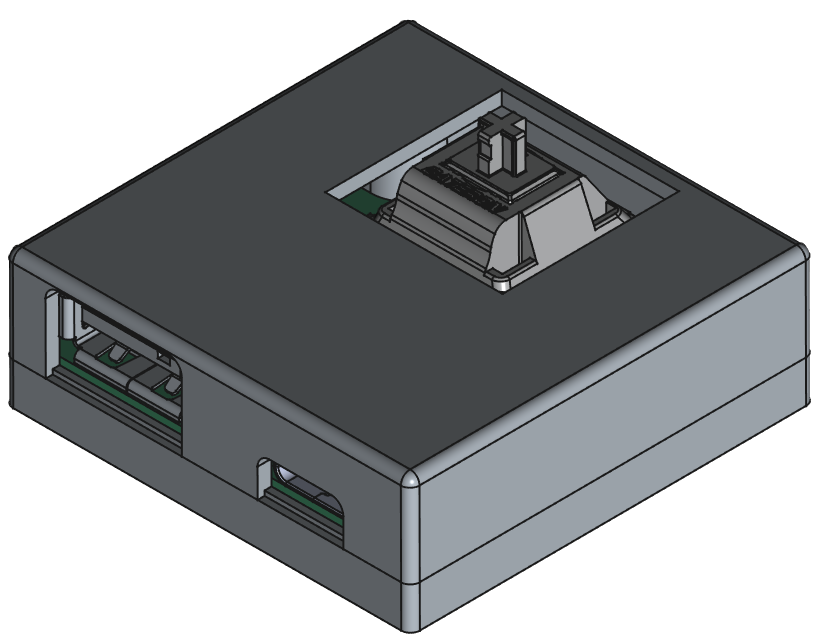
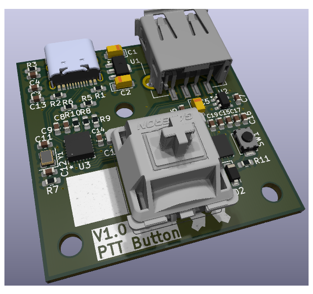

# PTTButton
 

## One Button Keyboard

A minimalistic keyboard with just one button.

Inspiered by [fnrow](https://github.com/dinofizz/fnrow-pcb) from Dino Fizzotti.

It uses USB Type C for uplink and has an additional USB Type A downlink port.

Currently uses QMK software from fnrow.

Used Chips:
 * [STM32F042G6U6](docs/stm32f042g6.pdf) Microcontroler
 * [Microchip USB2422](docs/00001726B.pdf) Two Port USB 2.0 Hub
 * [Texas Instruments TPS2051](docs/tps2051.pdf) USB Power Switch
